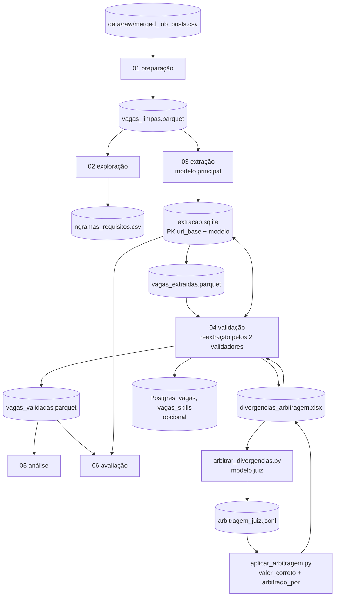

# Paradigma Vibe Coding: uma análise mercadológica por meio de vagas de emprego usando modelos de língua de grande escala

Pipeline de extração e validação de informação estruturada em anúncios de vaga de emprego, aplicado a um estudo sobre a adoção de IA generativa no desenvolvimento de software no mercado brasileiro.

A extração é feita por LLM e tratada como anotação sujeita a erro: três modelos independentes processam o corpus inteiro, as divergências são arbitradas e registradas, e a etapa final mede a confiabilidade do próprio instrumento.

| | |
|---|---|
| Corpus | 283 vagas únicas (346 coletadas), LinkedIn Brasil, jun–jul/2026 |
| Idiomas | 167 português, 116 inglês |
| Termos de busca | 9 (Engenheiro de IA, LLM, Desenvolvedor de IA, Eng. de Aprendizado de Máquina, IA Generativa, Vibe Coding, Engenharia de Prompt, RAG, Agentes de IA) |
| Extratores | 3 modelos de pesos abertos, 3 fornecedores |
| Arbitragem | `anthropic/claude-sonnet-5` como modelo juiz, 4º fornecedor |
| Runtime | Python 3.12, Jupyter |

## Arquitetura



O Parquet é o formato de intercâmbio entre etapas. O SQLite serve de checkpoint da extração: a chave primária `(url_base, modelo)` torna qualquer etapa reexecutável sem repetir chamadas já pagas.

## Etapas

| Notebook | Entrada | Saída | API |
|---|---|---|---|
| `01_data_preparation` | `merged_job_posts.csv` | `vagas_limpas.parquet` | não |
| `02_data_value_exploration` | `vagas_limpas.parquet` | `ngramas_requisitos.csv`, figuras inline | não |
| `03_llm_extraction` | `vagas_limpas.parquet` | `extracao.sqlite`, `vagas_extraidas.parquet` | sim |
| `04_extraction_validation` | `vagas_extraidas.parquet`, `extracao.sqlite` | `divergencias_arbitragem.xlsx`, `vagas_validadas.parquet`, tabelas Postgres | sim |
| `05_data_analysis` | `vagas_validadas.parquet` | figuras e tabelas inline | não |
| `06_evaluation` | `extracao.sqlite`, `vagas_validadas.parquet`, `divergencias_arbitragem.xlsx` | `verificacao_unanimidade.xlsx`, métricas inline | não |

Detalhamento do que cada etapa faz:

- **01** — deduplicação por conteúdo (título + empresa + descrição, agregando os termos de busca; URLs do LinkedIn são únicas por busca e não servem de chave), detecção de idioma, normalização de texto e segmentação da descrição em seções (`secao_requisitos`, `secao_responsabilidades`, `secao_beneficios`, `secao_empresa`, `secao_outros`). A seção de requisitos é detectável em 89% das vagas; nas demais a extração usa a descrição completa.
- **02** — frequência de termos e n-gramas sobre o texto bruto, usada para o contraste entre o rótulo "vibe coding" e o vocabulário efetivamente usado.
- **03** — extração estruturada pelo modelo principal, com `response_format` JSON Schema strict e validação Pydantic no cliente; grava no checkpoint SQLite e consolida em Parquet.
- **04** — reextração das mesmas vagas pelos dois validadores, cálculo de concordância, exportação das divergências para planilha, aplicação das decisões arbitradas e publicação opcional em Postgres.
- **05** — análise descritiva do corpus consolidado e agrupamento por embeddings das skills (`paraphrase-multilingual-MiniLM-L12-v2` + K-Means).
- **06** — avaliação do instrumento: acurácia e F1 de cada modelo contra o consolidado, acerto por modelo nas divergências, Friedman como teste global, McNemar exato por campo e auditoria da amostra de vagas unânimes.

Módulos auxiliares em `notebooks/`:

| Arquivo | Função |
|---|---|
| `extracao_comum.py` | schema Pydantic, prompt de sistema, cliente OpenRouter e `extrair_vaga()`, importados por 03 e 04 |
| `arbitrar_divergencias.py` | envia cada vaga divergente ao modelo juiz; checkpoint em `arbitragem_juiz.jsonl` |
| `aplicar_arbitragem.py` | escreve `valor_correto` na planilha sem sobrescrever anotação manual e registra a origem em `arbitrado_por` |
| `verificar_unanimidade.py` | audita a amostra de vagas em que os três modelos concordam |

## Schema de extração

Definido em `extracao_comum.py` como modelo Pydantic e enviado à API como JSON Schema strict.

| Campo | Tipo | Domínio |
|---|---|---|
| `skills_tecnicas` | `list[str]` | aberto, normalizado em inglês minúsculo |
| `praticas_genai` | `list[str]` | aberto (llm, rag, ai agents, prompt engineering, ...) |
| `ferramentas_ia_codigo` | `list[str]` | aberto (github copilot, cursor, claude code, ...) |
| `usa_ia_no_desenvolvimento` | enum | `exige`, `valoriza`, `menciona`, `nao_menciona` |
| `senioridade` | enum | `estagio`, `junior`, `pleno`, `senior`, `lider`, `nao_informado` |
| `modalidade` | enum | `remoto`, `hibrido`, `presencial`, `nao_informado` |
| `exige_ingles` | `bool` | |
| `exige_formacao_superior` | `bool` | |

`usa_ia_no_desenvolvimento` é a variável central: operacionaliza "vibe coding" como a expectativa de que a pessoa use ou construa com IA no próprio fluxo de trabalho.

A normalização de skills é responsabilidade do prompt, não de um pós-processamento — decisão que mantém o pipeline simples ao custo de variação residual de grafia, tratada nas métricas como piso conservador.

## Contratos de dados

CSV de entrada, 14 colunas:

```
keyword, url, job_title, company, location, salary, description_md,
description_raw, experience, job_type, function, industries, source_file, url_id
```

`vagas_limpas.parquet` (283 × 19) acrescenta `url_base`, `search_keywords`, `descricao`, `descricao_norm`, `idioma`, `n_caracteres` e as cinco colunas de seção. `vagas_extraidas.parquet` e `vagas_validadas.parquet` (283 × 27) acrescentam os oito campos do schema.

Checkpoint da extração:

```sql
CREATE TABLE extracoes (
    url_base    TEXT,
    modelo      TEXT,
    json        TEXT,
    extraido_em TEXT DEFAULT CURRENT_TIMESTAMP,
    PRIMARY KEY (url_base, modelo)
);
```

Planilhas em `data/validation/`:

| Arquivo | Conteúdo |
|---|---|
| `divergencias_arbitragem.xlsx` | uma linha por (vaga, campo) divergente, com as três respostas, `valor_correto` e `arbitrado_por` |
| `arbitragem_juiz.jsonl` | decisões brutas do juiz, uma linha por vaga |
| `verificacao_unanimidade.xlsx` | amostra de 15 vagas sem divergência, com coluna `campos_errados` |

Tabelas publicadas em Postgres: `vagas` (283 linhas, campos escalares) e `vagas_skills` (5.096 linhas, listas explodidas em formato longo).

## Instalação

```bash
pip install -r requirements.txt
cp .env.example .env
```

| Variável | Obrigatória | Uso |
|---|---|---|
| `OPENROUTER_API_KEY` | sim, nas etapas 03 e 04 | chamadas à OpenRouter |
| `NEON_DATABASE_URL` | não | publicação das tabelas finais em Postgres |

Modelos usados, configuráveis no topo dos notebooks 03, 04 e 06:

| Papel | Modelo | USD/M tokens (in/out) |
|---|---|---|
| Principal | `openai/gpt-oss-120b` | 0,036 / 0,18 |
| Validador 1 | `deepseek/deepseek-v4-flash` | 0,09 / 0,18 |
| Validador 2 | `google/gemma-4-31b-it` | 0,12 / 0,35 |
| Juiz (arbitragem) | `anthropic/claude-sonnet-5` | — |

Os três extratores são de pesos abertos, o que permite reproduzir a extração pela API ou com os modelos rodando localmente. `extra_body={"provider": {"require_parameters": True}}` restringe o roteamento da OpenRouter a provedores que suportam structured outputs.

## Execução

Coloque a coleta em `data/raw/merged_job_posts.csv` e execute os notebooks na ordem numérica. Somente 03 e 04 chamam a API; as demais etapas rodam offline sobre os artefatos já gravados.

```bash
jupyter nbconvert --to notebook --execute --inplace notebooks/06_evaluation.ipynb
```

Notas operacionais:

- Reexecutar 03 ou 04 não repete chamadas já registradas no SQLite; para forçar a reextração de uma vaga, remova a linha correspondente.
- A execução sequencial do lote leva algumas horas por modelo. As extrações do estudo foram feitas por um script efêmero com `ThreadPoolExecutor` gravando no mesmo checkpoint.
- `aplicar_arbitragem.py` nunca sobrescreve `valor_correto` já preenchido: anotação manual tem precedência sobre a decisão do juiz.
- As planilhas de `data/validation/` não são regeneradas se já existirem, para não descartar anotações.

## Validação e estatística

| Medida | Aplicação | Implementação |
|---|---|---|
| Fleiss' kappa | concordância entre os 3 modelos nos campos categóricos | `statsmodels` |
| Precisão/recall/F1 pareados, match exato | listas abertas; kappa é inadequado para conjunto aberto de rótulos (Hripcsak & Rothschild, 2005) | próprio |
| Friedman + Wilcoxon zero-split + Holm | teste global entre os 3 modelos, 283 vagas pareadas | `scipy` |
| McNemar exato + Holm por campo | post-hoc pareado, 3 comparações dentro de cada campo categórico | `statsmodels` |
| Bootstrap de vagas, 1.000 reamostragens | IC 95% da diferença de acurácia entre pares | `numpy`, semente 42 |

O modelo juiz não participa de nenhuma métrica de concordância: as três extrações permanecem independentes, e a arbitragem entra apenas como referência.

Duas ressalvas valem para a leitura dos números: nas vagas em que os três modelos concordam, a referência é o próprio consenso, e os três acertam por construção; nas listas, apenas divergências com F1 < 0,4 foram arbitradas, o que favorece o modelo principal — a comparação sem viés é validador contra validador.

## Resultados de referência

Valores obtidos na execução do estudo, úteis para conferir uma reprodução.

Instrumento:

| Métrica | Valor |
|---|---|
| Cobertura pelos 3 modelos | 283/283 |
| Fleiss' kappa | 0,83–0,88 (modalidade, inglês, formação) · 0,66 (senioridade) · 0,53 (`usa_ia_no_desenvolvimento`) |
| Divergências arbitradas | 266 (219 categóricas) |
| Acerto nas divergências categóricas | gemma 0,66 · gpt-oss 0,57 · deepseek 0,51 |
| Friedman, categóricos | χ² = 7,7 · p = 0,021 · nenhum par significativo no post-hoc |
| McNemar por campo | gpt-oss superior em senioridade e `usa_ia`, inferior em modalidade; validadores nunca diferem entre si |
| Auditoria da unanimidade | 10 de 15 vagas com algum campo contestado (~16% por campo) |

Objeto de estudo:

| Resultado | Valor |
|---|---|
| Exige uso de IA no desenvolvimento | 87,6% (mais 2,5% "valoriza"; faixa 81–93% conforme o extrator) |
| Ocorrência do termo "vibe coding" no texto | 1 vaga (0,4%), contra 22 retornadas pela busca do termo |
| Citam ao menos uma prática GenAI | 78% (llm 62,5% · ai agents 55,1% · rag 35,3% · prompt engineering 29,3%) |
| Nomeiam assistente de código específico | 5,7% (cursor 14 · claude code 10 · copilot 8) |
| Skills mais frequentes | python 77,7% · machine learning 35,3% · aws 35,0% · sql 28,3% · langchain 23,3% |
| Agrupamento por embeddings | k = 4, silhueta 0,123 (estrutura fraca, não interpretável como taxonomia) |

## Dados

O corpus de vagas não é redistribuído: as descrições são conteúdo de terceiros publicado em plataforma privada. O pipeline roda sobre qualquer coleta que respeite o contrato de colunas descrito acima.

## Limitações conhecidas

1. Viés de seleção. As vagas vieram de nove buscas por termos de IA; o estudo descreve o perfil das vagas de IA no LinkedIn Brasil, não a penetração de IA no mercado de desenvolvimento como um todo.
2. A variável central é a de menor concordância entre modelos (κ = 0,53).
3. A arbitragem e a auditoria foram feitas por LLM, não por leitura humana. Erros correlacionados entre os quatro modelos são invisíveis a este desenho. A auditoria humana por amostra das decisões do juiz permanece pendente.
4. Consenso não é acerto: cerca de 16% das decisões de campo em vagas unânimes foram contestadas na auditoria.
5. Normalização imperfeita das listas (`rag` e `retrieval-augmented generation` contados em separado; vazamento de categoria em `ferramentas_ia_codigo`, corrigido na análise por lista curada).
6. Ruído de coleta: cerca de 2% das vagas não são de desenvolvimento de software.
7. Coleta única, sem série temporal e sem grupo de controle de vagas não relacionadas a IA. Salário informado em ~1% das vagas, descartado.

## Licença

Código sob licença MIT, ver `LICENSE`.

```
PONTES, Andrey. Paradigma Vibe Coding: uma análise mercadológica por meio de
vagas de emprego usando modelos de língua de grande escala.
Trabalho de iniciação científica, 2026.
https://github.com/andrey-pontes/pipeline-vagas-vibe-coding
```
